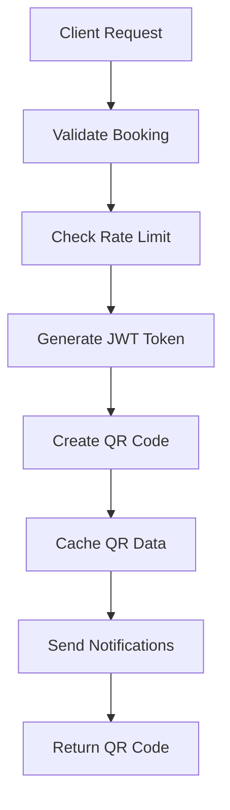
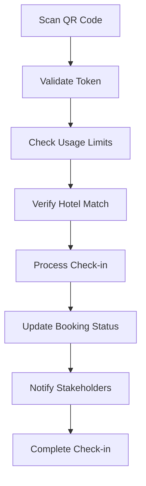
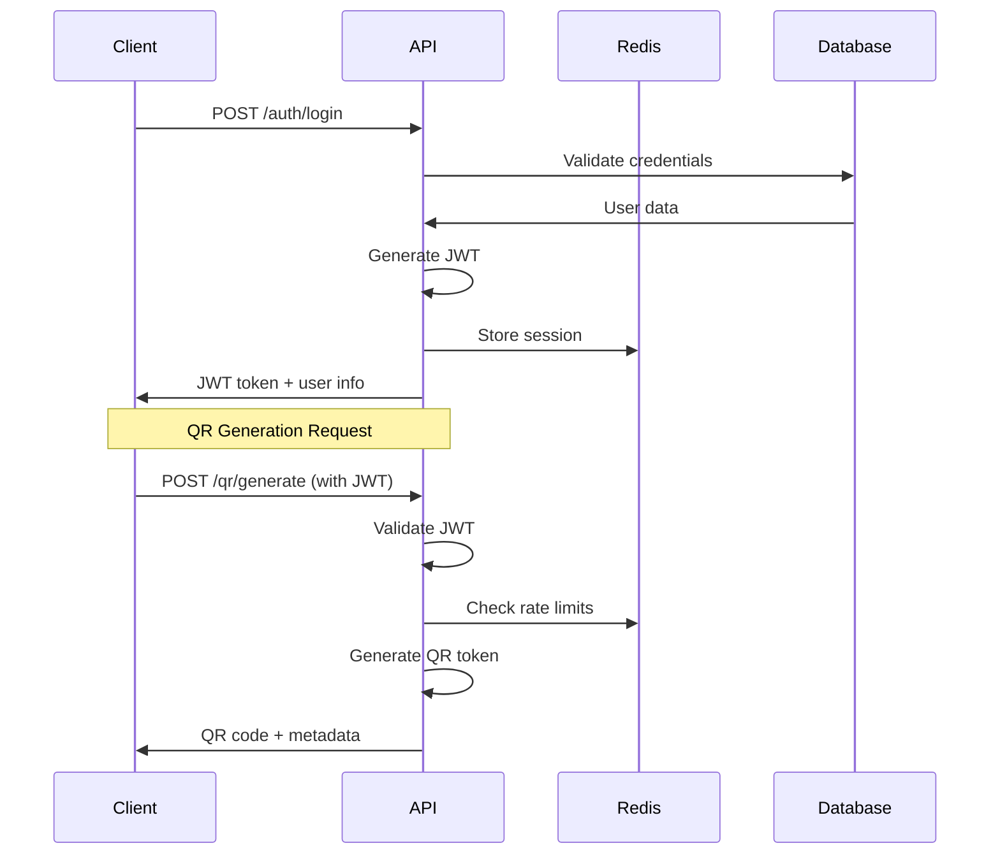
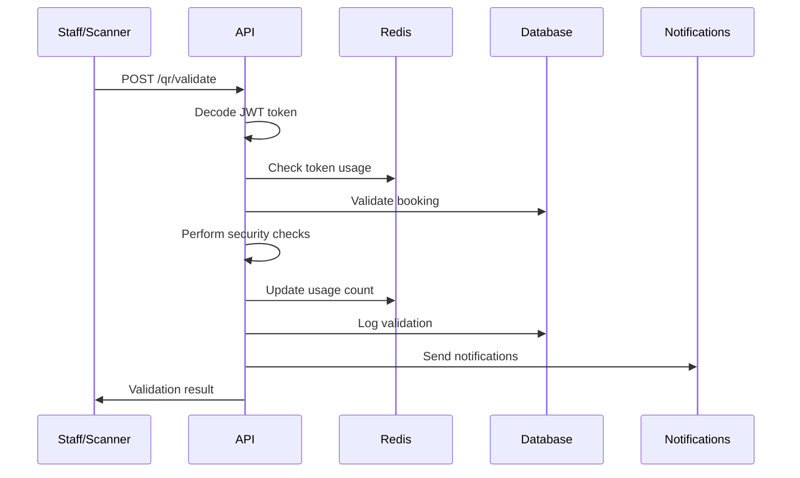

# QR Codes System Documentation

## Table of Contents
1. [Architecture Overview](#architecture)
2. [API Reference](#api-reference)
3. [Security & Authentication](#security)
4. [Integration Guide](#integration)
5. [Performance & Monitoring](#performance)
6. [Troubleshooting](#troubleshooting)

## Architecture Overview {#architecture}

### QR System Components
```
┌─────────────────┐    ┌─────────────────┐    ┌─────────────────┐
│   QR Generator  │    │   QR Validator  │    │   QR Processor  │
│   - JWT Token   │◄──►│   - Security    │◄──►│   - Check-in    │
│   - Styling     │    │   - Usage Count │    │   - Real-time   │
│   - Encryption  │    │   - Expiry      │    │   - Audit Trail │
└─────────────────┘    └─────────────────┘    └─────────────────┘
          │                        │                        │
          ▼                        ▼                        ▼
┌─────────────────┐    ┌─────────────────┐    ┌─────────────────┐
│   Redis Cache   │    │   Database      │    │   Notifications │
│   - Token Store │    │   - QR Tracking │    │   - Real-time   │
│   - Rate Limit  │    │   - Analytics   │    │   - Email/SMS   │
└─────────────────┘    └─────────────────┘    └─────────────────┘
```

### QR Generation Workflow


### QR Check-in Process Flow


## API Reference {#api-reference}

### QR Generation

#### Generate Check-in QR Code
```http
POST /api/qr/generate/checkin
Authorization: Bearer <jwt-token>
Content-Type: application/json
```

**Request Body:**
```json
{
  "bookingId": "64a1b2c3d4e5f6789012348",
  "style": "hotel",
  "expiresIn": 86400,
  "customOptions": {
    "size": 300,
    "errorCorrection": "H",
    "margin": 2
  }
}
```

**Response (201 Created):**
```json
{
  "success": true,
  "message": "QR code de check-in généré avec succès",
  "data": {
    "qrCode": {
      "dataURL": "data:image/png;base64,iVBORw0KGgoAAAANSUhEUg...",
      "svg": "<svg xmlns='http://www.w3.org/2000/svg'>...</svg>",
      "buffer": "<Buffer 89 50 4e 47...>",
      "metadata": {
        "format": "image/png",
        "width": 300,
        "height": 300,
        "size": 15420,
        "style": "hotel"
      }
    },
    "token": "eyJhbGciOiJIUzI1NiIsInR5cCI6IkpXVCJ9...",
    "booking": {
      "id": "64a1b2c3d4e5f6789012348",
      "confirmationNumber": "HTL001-240315",
      "hotel": "Grand Hotel Palace",
      "checkInDate": "2025-06-15T14:00:00Z",
      "checkOutDate": "2025-06-18T11:00:00Z",
      "customer": "John Doe",
      "rooms": 2,
      "guests": 4
    },
    "validity": {
      "expiresAt": "2025-06-16T14:00:00Z",
      "maxUsage": 5,
      "hoursValid": 24
    },
    "instructions": {
      "title": "QR Code Check-in",
      "steps": [
        "Présentez ce QR code à la réception de l'hôtel",
        "Le staff scannera le code pour votre check-in",
        "Votre chambre sera attribuée automatiquement",
        "Récupérez vos clés et profitez de votre séjour!"
      ],
      "validity": "Valable jusqu'au 16/06/2025 à 14:00",
      "support": "Contactez la réception en cas de problème",
      "hotel": {
        "name": "Grand Hotel Palace",
        "phone": "+33123456789"
      },
      "important": [
        "Ne partagez pas ce QR code",
        "Présentez-vous avec une pièce d'identité",
        "Le QR code peut être utilisé maximum 5 fois"
      ]
    },
    "securityInfo": {
      "tokenId": "qr_64a1b2c3d4e5f6789012348_1650123456",
      "generatedAt": "2025-06-15T10:30:00Z",
      "securityLevel": "HIGH"
    }
  }
}
```

#### Generate Generic QR Code
```http
POST /api/qr/generate
Authorization: Bearer <jwt-token>
Content-Type: application/json
```

**Request Body:**
```json
{
  "type": "WIFI",
  "identifier": "wifi_lobby_access",
  "expiresIn": 3600,
  "maxUsage": 50,
  "style": "mobile",
  "networkName": "Hotel_Guest_WiFi",
  "password": "GuestAccess2025",
  "encryption": "WPA2"
}
```

### QR Validation

#### Validate QR Code
```http
POST /api/qr/validate
Authorization: Bearer <jwt-token>
Content-Type: application/json
```

**Request Body:**
```json
{
  "token": "eyJhbGciOiJIUzI1NiIsInR5cCI6IkpXVCJ9...",
  "action": "validate",
  "context": {
    "hotelId": "64a1b2c3d4e5f6789012346",
    "ipAddress": "192.168.1.100",
    "userAgent": "Mozilla/5.0...",
    "deviceInfo": {
      "platform": "iPhone",
      "browser": "Safari"
    }
  }
}
```

**Response (200 OK):**
```json
{
  "success": true,
  "message": "QR code validé avec succès",
  "data": {
    "type": "CHECK_IN",
    "identifier": "checkin_64a1b2c3d4e5f6789012348",
    "issuedAt": "2025-06-15T10:30:00Z",
    "expiresAt": "2025-06-16T10:30:00Z",
    "usageCount": 1,
    "maxUsage": 5,
    "remainingUsage": 4,
    "payload": {
      "bookingId": "64a1b2c3d4e5f6789012348",
      "hotelId": "64a1b2c3d4e5f6789012346",
      "userId": "64a1b2c3d4e5f6789012345",
      "customerName": "John Doe",
      "hotelName": "Grand Hotel Palace",
      "checkInDate": "2025-06-15T14:00:00Z",
      "checkOutDate": "2025-06-18T11:00:00Z"
    },
    "enrichedData": {
      "booking": {
        "status": "CONFIRMED",
        "checkInDate": "2025-06-15T14:00:00Z",
        "checkOutDate": "2025-06-18T11:00:00Z",
        "roomsCount": 2
      },
      "hotel": {
        "name": "Grand Hotel Palace",
        "phone": "+33123456789"
      },
      "customer": {
        "name": "John Doe"
      }
    },
    "contextValidation": {
      "hotelMatch": true,
      "ipValidation": "passed",
      "deviceConsistency": true
    }
  },
  "validation": {
    "validatedBy": "64a1b2c3d4e5f6789012345",
    "validatedAt": "2025-06-15T11:00:00Z",
    "method": "validate",
    "context": {
      "hotel": "Grand Hotel Palace",
      "device": "iPhone Safari"
    }
  }
}
```

### QR Check-in Processing

#### Process QR Check-in
```http
POST /api/qr/checkin/process
Authorization: Bearer <jwt-token>
Content-Type: application/json
```

**Request Body:**
```json
{
  "token": "eyJhbGciOiJIUzI1NiIsInR5cCI6IkpXVCJ9...",
  "hotelId": "64a1b2c3d4e5f6789012346",
  "roomAssignments": [
    {
      "roomId": "64a1b2c3d4e5f6789012347",
      "roomNumber": "101",
      "guests": ["John Doe", "Jane Doe"]
    },
    {
      "roomId": "64a1b2c3d4e5f6789012348",
      "roomNumber": "102",
      "guests": ["Child 1", "Child 2"]
    }
  ],
  "guestNotes": "Client VIP - Prévoir upgrade si disponible",
  "additionalServices": [
    {
      "name": "Petit-déjeuner",
      "quantity": 4,
      "price": 15.00
    }
  ],
  "skipRoomAssignment": false
}
```

**Response (200 OK):**
```json
{
  "success": true,
  "message": "Check-in QR traité avec succès",
  "data": {
    "booking": {
      "id": "64a1b2c3d4e5f6789012348",
      "confirmationNumber": "HTL001-240315",
      "customer": "John Doe",
      "hotel": "Grand Hotel Palace",
      "checkInTime": "2025-06-15T11:30:00Z",
      "status": "CHECKED_IN"
    },
    "qrProcessing": {
      "tokenUsed": "qr_64a1b2c3d4e5f6789012348_1650123456",
      "remainingUsage": 4,
      "method": "QR_CODE",
      "processedAt": "2025-06-15T11:30:00Z"
    },
    "roomInfo": {
      "assigned": 2,
      "total": 2,
      "assignmentStatus": "COMPLETED",
      "assignments": [
        {
          "roomNumber": "101",
          "roomType": "Double",
          "floor": 1,
          "guests": ["John Doe", "Jane Doe"]
        },
        {
          "roomNumber": "102",
          "roomType": "Double",
          "floor": 1,
          "guests": ["Child 1", "Child 2"]
        }
      ]
    },
    "workflow": {
      "checkInCompleted": true,
      "paymentStatus": "COMPLETED",
      "keyCollection": "REQUIRED",
      "housekeepingNotified": true
    },
    "nextSteps": {
      "staff": [
        "Remettez les clés au client",
        "Vérifiez la propreté des chambres",
        "Informez sur les services de l'hôtel"
      ],
      "guest": [
        "Récupération des clés",
        "Installation en chambre",
        "Découverte des services"
      ]
    },
    "notifications": {
      "customerNotified": true,
      "hotelTeamNotified": true,
      "adminNotified": true,
      "checkInTime": "2025-06-15T11:30:00Z"
    }
  }
}
```

### QR Status Tracking

#### Get QR Status
```http
GET /api/qr/status/{identifier}
Authorization: Bearer <jwt-token>
```

**Response (200 OK):**
```json
{
  "success": true,
  "data": {
    "identifier": "checkin_64a1b2c3d4e5f6789012348",
    "type": "CHECK_IN",
    "bookingId": "64a1b2c3d4e5f6789012348",
    "created": {
      "at": "2025-06-15T10:30:00Z",
      "by": "64a1b2c3d4e5f6789012345",
      "expiresAt": "2025-06-16T10:30:00Z"
    },
    "usage": {
      "validations": 3,
      "uses": 1,
      "errors": 0,
      "lastActivity": "2025-06-15T11:30:00Z",
      "lastActivityType": "QR_USED"
    },
    "current": {
      "status": "used",
      "isExpired": false,
      "isActive": false,
      "securityLevel": "NORMAL"
    },
    "bookingStatus": {
      "status": "CHECKED_IN",
      "checkInDate": "2025-06-15T11:30:00Z",
      "hotel": "Grand Hotel Palace"
    },
    "timeline": [
      {
        "event": "QR_GENERATED",
        "timestamp": "2025-06-15T10:30:00Z",
        "context": "Mobile app generation"
      },
      {
        "event": "QR_VALIDATED",
        "timestamp": "2025-06-15T11:00:00Z",
        "context": "Reception validation"
      },
      {
        "event": "QR_USED",
        "timestamp": "2025-06-15T11:30:00Z",
        "context": "Check-in completed"
      }
    ]
  },
  "meta": {
    "totalEvents": 5,
    "analysisDate": "2025-06-15T12:00:00Z",
    "accessLevel": "FULL"
  }
}
```

#### List User QR Codes
```http
GET /api/qr/my-codes?type=CHECK_IN&status=active&limit=20&sortBy=createdAt&sortOrder=desc
Authorization: Bearer <jwt-token>
```

**Response (200 OK):**
```json
{
  "success": true,
  "data": {
    "qrCodes": [
      {
        "identifier": "checkin_64a1b2c3d4e5f6789012348",
        "type": "CHECK_IN",
        "status": "used",
        "createdAt": "2025-06-15T10:30:00Z",
        "expiresAt": "2025-06-16T10:30:00Z",
        "usageCount": 1,
        "lastUsed": "2025-06-15T11:30:00Z",
        "isActive": false,
        "securityLevel": "NORMAL",
        "bookingInfo": {
          "confirmationNumber": "HTL001-240315",
          "status": "CHECKED_IN",
          "checkIn": "2025-06-15T14:00:00Z",
          "checkOut": "2025-06-18T11:00:00Z",
          "hotel": "Grand Hotel Palace",
          "customer": "John Doe"
        }
      }
    ],
    "pagination": {
      "total": 15,
      "returned": 1,
      "limit": 20,
      "offset": 0,
      "hasMore": false
    },
    "filters": {
      "type": "CHECK_IN",
      "status": "active",
      "sortBy": "createdAt",
      "sortOrder": "desc"
    },
    "summary": {
      "total": 15,
      "byStatus": {
        "active": 2,
        "used": 8,
        "expired": 4,
        "revoked": 1
      },
      "byType": {
        "CHECK_IN": 10,
        "CHECK_OUT": 3,
        "WIFI": 2
      },
      "totalUsage": 12,
      "activeCount": 2,
      "expiredCount": 4
    }
  }
}
```

### Batch Operations

#### Generate Batch QR Codes
```http
POST /api/qr/batch/generate
Authorization: Bearer <jwt-token>
Content-Type: application/json
```

**Request Body:**
```json
{
  "payloads": [
    {
      "type": "CHECK_IN",
      "identifier": "checkin_booking_001",
      "bookingId": "64a1b2c3d4e5f6789012348",
      "hotelId": "64a1b2c3d4e5f6789012346"
    },
    {
      "type": "WIFI",
      "identifier": "wifi_lobby_001",
      "networkName": "Hotel_Guest_WiFi",
      "password": "GuestAccess2025"
    }
  ],
  "options": {
    "style": "hotel",
    "expiresIn": 86400,
    "maxUsage": 10,
    "batchSize": 10
  }
}
```

**Response (201 Created):**
```json
{
  "success": true,
  "message": "Génération en lot terminée: 2/2 réussies",
  "data": {
    "batchId": "batch_1650123456_abc123",
    "summary": {
      "total": 2,
      "successful": 2,
      "failed": 0,
      "successRate": 100,
      "failureRate": 0,
      "duration": 1250
    },
    "results": [
      {
        "index": 0,
        "success": true,
        "qrCode": {
          "dataURL": "data:image/png;base64,iVBORw0KGgoAAAANSUhEUg...",
          "metadata": {
            "format": "image/png",
            "width": 300,
            "size": 15420
          }
        },
        "token": "eyJhbGciOiJIUzI1NiIsInR5cCI6IkpXVCJ9...",
        "type": "CHECK_IN",
        "identifier": "checkin_booking_001"
      },
      {
        "index": 1,
        "success": true,
        "qrCode": {
          "dataURL": "data:image/png;base64,iVBORw0KGgoAAAANSUhEUg...",
          "metadata": {
            "format": "image/png",
            "width": 300,
            "size": 14890
          }
        },
        "token": "eyJhbGciOiJIUzI1NiIsInR5cCI6IkpXVCJ9...",
        "type": "WIFI",
        "identifier": "wifi_lobby_001"
      }
    ],
    "failedItems": [],
    "analysis": {
      "successRate": 100,
      "failureRate": 0,
      "avgGenerationTime": 625,
      "errors": {}
    },
    "performance": {
      "averageGenerationTime": 625,
      "throughput": 1.6
    }
  }
}
```

### Admin Management

#### Revoke QR Code
```http
POST /api/qr/admin/revoke
Authorization: Bearer <admin-token>
Content-Type: application/json
```

**Request Body:**
```json
{
  "tokenId": "qr_64a1b2c3d4e5f6789012348_1650123456",
  "reason": "Suspicious activity detected - multiple failed validation attempts",
  "notifyUser": true
}
```

**Response (200 OK):**
```json
{
  "success": true,
  "message": "QR code révoqué avec succès",
  "data": {
    "tokenId": "qr_64a1b2c3d4e5f6789012348_1650123456",
    "reason": "Suspicious activity detected - multiple failed validation attempts",
    "revokedBy": "64a1b2c3d4e5f6789012345",
    "revokedAt": "2025-06-15T12:00:00Z",
    "userNotified": true,
    "originalTokenInfo": {
      "type": "CHECK_IN",
      "identifier": "checkin_64a1b2c3d4e5f6789012348",
      "userId": "64a1b2c3d4e5f6789012345"
    }
  }
}
```

#### Get QR Statistics
```http
GET /api/qr/admin/stats?period=30d&hotelId=64a1b2c3d4e5f6789012346&includeDetails=true
Authorization: Bearer <admin-token>
```

**Response (200 OK):**
```json
{
  "success": true,
  "data": {
    "service": {
      "rateLimitCache": 15,
      "auditLogSize": 1250,
      "recentEvents": {
        "QR_GENERATED": 45,
        "QR_VALIDATED": 38,
        "QR_USED": 32,
        "QR_VALIDATION_FAILED": 6,
        "QR_REVOKED": 2
      },
      "config": {
        "maxTokenAge": 86400,
        "maxUsageCount": 10,
        "rateLimitWindow": 60000,
        "features": {
          "enableCaching": true,
          "enableRateLimit": true,
          "enableAuditLog": true,
          "enableBatchGeneration": true
        }
      }
    },
    "period": {
      "range": "30d",
      "startDate": "2025-05-16T00:00:00Z",
      "endDate": "2025-06-15T23:59:59Z",
      "totalEvents": 123
    },
    "events": {
      "breakdown": {
        "QR_GENERATED": 45,
        "QR_VALIDATED": 38,
        "QR_USED": 32,
        "QR_VALIDATION_FAILED": 6,
        "QR_REVOKED": 2
      },
      "total": 123
    },
    "types": {
      "CHECK_IN": 35,
      "CHECK_OUT": 8,
      "WIFI": 12,
      "PAYMENT": 5,
      "MENU": 3
    },
    "users": [
      {
        "userId": "64a1b2c3d4e5f6789012345",
        "totalActivity": 15,
        "generations": 8,
        "validations": 5,
        "usages": 2
      }
    ],
    "temporal": {
      "hourly": {
        "9": 12,
        "10": 18,
        "11": 25,
        "14": 15,
        "15": 20
      },
      "daily": {
        "2025-06-14": 8,
        "2025-06-15": 12
      }
    },
    "performance": {
      "generationRate": 1.5,
      "validationRate": 1.27,
      "errorRate": 4.88
    },
    "topUsers": [
      {
        "userId": "64a1b2c3d4e5f6789012345",
        "activityCount": 15
      }
    ],
    "alerts": [
      {
        "type": "HIGH_ERROR_RATE",
        "severity": "warning",
        "message": "Taux d'erreur élevé: 12.5%",
        "threshold": 10,
        "current": 12.5
      }
    ],
    "recommendations": [
      {
        "type": "engagement",
        "priority": "medium",
        "title": "Améliorer l'adoption QR",
        "description": "Moins de 75% des réservations utilisent les QR codes",
        "actions": [
          "Formation staff réception",
          "Améliorer visibilité QR",
          "Simplifier processus scan"
        ]
      }
    ]
  },
  "meta": {
    "period": "30d",
    "hotelFilter": "64a1b2c3d4e5f6789012346",
    "generatedAt": "2025-06-15T12:00:00Z"
  }
}
```

#### Get QR Audit Logs
```http
GET /api/qr/admin/audit?limit=50&event=QR_VALIDATION_FAILED&severity=warning&startDate=2025-06-14T00:00:00Z
Authorization: Bearer <admin-token>
```

**Response (200 OK):**
```json
{
  "success": true,
  "data": {
    "logs": [
      {
        "timestamp": "2025-06-15T11:45:00Z",
        "event": "QR_VALIDATION_FAILED",
        "data": {
          "token": "eyJhbGciOiJIUzI1NiIsInR5cCI6IkpXVCJ9...",
          "identifier": "checkin_64a1b2c3d4e5f6789012348",
          "userId": "64a1b2c3d4e5f6789012345"
        },
        "context": {
          "ipAddress": "192.168.1.100",
          "userAgent": "Mozilla/5.0...",
          "hotelId": "64a1b2c3d4e5f6789012346"
        },
        "error": "Token has expired",
        "source": "QRCodeService",
        "severity": "warning",
        "enriched": {
          "user": {
            "name": "John Doe",
            "email": "john.doe@example.com",
            "role": "CLIENT"
          },
          "booking": {
            "confirmationNumber": "HTL001-240315",
            "status": "CONFIRMED",
            "hotel": "Grand Hotel Palace"
          }
        }
      }
    ],
    "pagination": {
      "total": 15,
      "returned": 1,
      "limit": 50,
      "offset": 0,
      "hasMore": false
    },
    "filters": {
      "event": "QR_VALIDATION_FAILED",
      "userId": null,
      "startDate": "2025-06-14T00:00:00Z",
      "endDate": null,
      "severity": "warning"
    },
    "summary": {
      "totalEvents": 15,
      "uniqueUsers": 8,
      "eventTypes": ["QR_VALIDATION_FAILED"],
      "dateRange": {
        "oldest": "2025-06-14T08:30:00Z",
        "newest": "2025-06-15T11:45:00Z"
      }
    }
  }
}
```

## Security & Authentication {#security}

### JWT Token Structure
```javascript
{
  // Standard JWT Claims
  "jti": "qr_64a1b2c3d4e5f6789012348_1650123456", // Unique token ID
  "iat": 1650123456,                               // Issued at
  "exp": 1650209856,                               // Expires at
  "nbf": 1650123456,                               // Not before
  "iss": "HotelManagement",                        // Issuer
  "aud": "hotel-app",                              // Audience
  
  // QR-specific Claims
  "type": "CHECK_IN",                              // QR type
  "identifier": "checkin_64a1b2c3d4e5f6789012348", // Unique identifier
  "bookingId": "64a1b2c3d4e5f6789012348",         // Booking reference
  "hotelId": "64a1b2c3d4e5f6789012346",           // Hotel reference
  "userId": "64a1b2c3d4e5f6789012345",            // User reference
  "customerName": "John Doe",                      // Customer name
  "hotelName": "Grand Hotel Palace",               // Hotel name
  
  // Usage Control
  "maxUsage": 5,                                   // Max scan count
  "usageCount": 0,                                 // Current usage
  
  // Security
  "generatedBy": "64a1b2c3d4e5f6789012345",       // Generated by user
  "deviceInfo": {...},                             // Device context
  "ipAddress": "192.168.1.100",                   // IP address
  "checksum": "a1b2c3d4e5f6"                      // Integrity check
}
```

### Security Features

#### Rate Limiting
```javascript
// QR Generation Rate Limits
const QR_RATE_LIMITS = {
  generation: {
    window: 60 * 1000,        // 1 minute
    max: 5,                   // 5 QR generations per minute
    skipFailedRequests: true
  },
  validation: {
    window: 60 * 1000,        // 1 minute
    max: 20,                  // 20 QR validations per minute
    skipSuccessfulRequests: false
  },
  checkIn: {
    window: 60 * 1000,        // 1 minute
    max: 10,                  // 10 check-in attempts per minute
    skipSuccessfulRequests: true
  }
}
```

#### IP Whitelisting (Optional)
```javascript
// Hotel-specific IP whitelist
const HOTEL_IP_WHITELIST = {
  "64a1b2c3d4e5f6789012346": [
    "192.168.1.0/24",         // Hotel internal network
    "10.0.0.0/8",             // Private network
    "203.0.113.0/24"          // Hotel public IP range
  ]
}
```

#### Anti-Fraud Protection
```javascript
// Fraud detection patterns
const FRAUD_DETECTION = {
  suspiciousPatterns: {
    rapidGeneration: {
      threshold: 10,              // 10 QR codes in short time
      timeWindow: 300000,         // 5 minutes
      action: "RATE_LIMIT"
    },
    multipleFailures: {
      threshold: 5,               // 5 failed validations
      timeWindow: 600000,         // 10 minutes
      action: "TEMPORARY_BAN"
    },
    unusualLocations: {
      maxDistance: 100,           // 100km from hotel
      action: "REQUIRE_VERIFICATION"
    }
  },
  securityLevels: {
    BASIC: {
      encryption: false,
      ipValidation: false,
      deviceFingerprinting: false
    },
    STANDARD: {
      encryption: true,
      ipValidation: true,
      deviceFingerprinting: false
    },
    HIGH: {
      encryption: true,
      ipValidation: true,
      deviceFingerprinting: true,
      biometricRequired: false
    }
  }
}
```

#### Encryption & Integrity
```javascript
// QR Token encryption
const QR_SECURITY = {
  encryption: {
    algorithm: 'aes-256-cbc',
    keyDerivation: 'pbkdf2',
    iterations: 10000,
    saltLength: 32
  },
  integrity: {
    checksumAlgorithm: 'sha256',
    includeTimestamp: true,
    includeDeviceInfo: true
  },
  validation: {
    strictMode: true,
    allowClockSkew: 30,         // 30 seconds
    requireIPMatch: false,
    requireDeviceMatch: false
  }
}
```

### Authentication Flow

#### User Authentication


#### QR Validation Flow


## Integration Guide {#integration}

### Frontend Integration

#### React Component Example
```jsx
import React, { useState, useEffect } from 'react';
import { QRCodeCanvas } from 'qrcode.react';

const QRCheckInComponent = ({ bookingId }) => {
  const [qrData, setQrData] = useState(null);
  const [loading, setLoading] = useState(false);
  const [error, setError] = useState(null);

  const generateQRCode = async () => {
    setLoading(true);
    setError(null);
    
    try {
      const response = await fetch('/api/qr/generate/checkin', {
        method: 'POST',
        headers: {
          'Authorization': `Bearer ${localStorage.getItem('token')}`,
          'Content-Type': 'application/json'
        },
        body: JSON.stringify({
          bookingId,
          style: 'hotel',
          expiresIn: 86400
        })
      });

      if (!response.ok) {
        throw new Error('Failed to generate QR code');
      }

      const data = await response.json();
      setQrData(data.data);
    } catch (err) {
      setError(err.message);
    } finally {
      setLoading(false);
    }
  };

  useEffect(() => {
    if (bookingId) {
      generateQRCode();
    }
  }, [bookingId]);

  if (loading) return <div>Génération du QR code...</div>;
  if (error) return <div>Erreur: {error}</div>;
  if (!qrData) return null;

  return (
    <div className="qr-checkin-container">
      <h3>QR Code Check-in</h3>
      
      <div className="qr-code-display">
        
      </div>
      
      <div className="qr-info">
        <p><strong>Hôtel:</strong> {qrData.booking.hotel}</p>
        <p><strong>Check-in:</strong> {new Date(qrData.booking.checkInDate).toLocaleDateString()}</p>
        <p><strong>Expire:</strong> {new Date(qrData.validity.expiresAt).toLocaleString()}</p>
        <p><strong>Utilisations restantes:</strong> {qrData.validity.maxUsage}</p>
      </div>
      
      <div className="qr-instructions">
        <h4>{qrData.instructions.title}</h4>
        <ul>
          {qrData.instructions.steps.map((step, index) => (
            <li key={index}>{step}</li>
          ))}
        </ul>
        <p className="validity-info">{qrData.instructions.validity}</p>
      </div>
    </div>
  );
};

export default QRCheckInComponent;
```

#### Vue.js Component Example
```vue
<template>
  <div class="qr-scanner-component">
    <h3>Scanner QR Code</h3>
    
    <div v-if="!scanning" class="scan-controls">
      <button @click="startScanning" class="start-scan-btn">
        Commencer le scan
      </button>
    </div>
    
    <div v-if="scanning" class="scanner-container">
      <video ref="video" autoplay playsinline></video>
      <canvas ref="canvas" style="display: none;"></canvas>
      
      <div class="scan-overlay">
        <div class="scan-frame"></div>
        <p>Centrez le QR code dans le cadre</p>
      </div>
      
      <button @click="stopScanning" class="stop-scan-btn">
        Arrêter le scan
      </button>
    </div>
    
    <div v-if="result" class="scan-result">
      <h4>QR Code scanné avec succès!</h4>
      <div class="booking-info">
        <p><strong>Client:</strong> {{ result.customerName }}</p>
        <p><strong>Hôtel:</strong> {{ result.hotelName }}</p>
        <p><strong>Réservation:</strong> {{ result.bookingId }}</p>
      </div>
      
      <div class="action-buttons">
        <button @click="validateQR" class="validate-btn" :disabled="validating">
          {{ validating ? 'Validation...' : 'Valider QR Code' }}
        </button>
        <button @click="processCheckIn" class="checkin-btn" :disabled="!validated">
          Traiter Check-in
        </button>
      </div>
    </div>
    
    <div v-if="error" class="error-message">
      {{ error }}
    </div>
  </div>
</template>

<script>
import jsQR from 'jsqr';

export default {
  name: 'QRScannerComponent',
  data() {
    return {
      scanning: false,
      result: null,
      validated: false,
      validating: false,
      error: null,
      stream: null
    };
  },
  methods: {
    async startScanning() {
      try {
        this.scanning = true;
        this.error = null;
        
        const stream = await navigator.mediaDevices.getUserMedia({
          video: { facingMode: 'environment' }
        });
        
        this.$refs.video.srcObject = stream;
        this.stream = stream;
        
        this.scanQRCode();
      } catch (err) {
        this.error = 'Impossible d\'accéder à la caméra';
        this.scanning = false;
      }
    },
    
    stopScanning() {
      if (this.stream) {
        this.stream.getTracks().forEach(track => track.stop());
      }
      this.scanning = false;
    },
    
    scanQRCode() {
      const video = this.$refs.video;
      const canvas = this.$refs.canvas;
      const context = canvas.getContext('2d');
      
      const scan = () => {
        if (!this.scanning) return;
        
        if (video.readyState === video.HAVE_ENOUGH_DATA) {
          canvas.width = video.videoWidth;
          canvas.height = video.videoHeight;
          context.drawImage(video, 0, 0, canvas.width, canvas.height);
          
          const imageData = context.getImageData(0, 0, canvas.width, canvas.height);
          const code = jsQR(imageData.data, imageData.width, imageData.height);
          
          if (code) {
            this.handleQRDetected(code.data);
            return;
          }
        }
        
        requestAnimationFrame(scan);
      };
      
      scan();
    },
    
    handleQRDetected(qrData) {
      try {
        // Assuming QR data is a JWT token
        this.result = this.parseQRToken(qrData);
        this.stopScanning();
      } catch (err) {
        this.error = 'QR Code invalide';
      }
    },
    
    parseQRToken(token) {
      // Decode JWT token (simplified - use proper JWT library)
      const payload = JSON.parse(atob(token.split('.')[1]));
      return {
        token: token,
        customerName: payload.customerName,
        hotelName: payload.hotelName,
        bookingId: payload.bookingId,
        type: payload.type
      };
    },
    
    async validateQR() {
      this.validating = true;
      this.error = null;
      
      try {
        const response = await fetch('/api/qr/validate', {
          method: 'POST',
          headers: {
            'Authorization': `Bearer ${this.$store.state.auth.token}`,
            'Content-Type': 'application/json'
          },
          body: JSON.stringify({
            token: this.result.token,
            context: {
              hotelId: this.$store.state.user.hotelId
            }
          })
        });
        
        if (!response.ok) {
          throw new Error('Validation échouée');
        }
        
        const data = await response.json();
        this.validated = true;
        this.$emit('qr-validated', data);
      } catch (err) {
        this.error = err.message;
      } finally {
        this.validating = false;
      }
    },
    
    async processCheckIn() {
      if (!this.validated) return;
      
      try {
        const response = await fetch('/api/qr/checkin/process', {
          method: 'POST',
          headers: {
            'Authorization': `Bearer ${this.$store.state.auth.token}`,
            'Content-Type': 'application/json'
          },
          body: JSON.stringify({
            token: this.result.token,
            hotelId: this.$store.state.user.hotelId,
            roomAssignments: [],
            skipRoomAssignment: true
          })
        });
        
        if (!response.ok) {
          throw new Error('Check-in échoué');
        }
        
        const data = await response.json();
        this.$emit('checkin-completed', data);
        
        // Reset component
        this.result = null;
        this.validated = false;
      } catch (err) {
        this.error = err.message;
      }
    }
  },
  
  beforeDestroy() {
    this.stopScanning();
  }
};
</script>

<style scoped>
.qr-scanner-component {
  max-width: 500px;
  margin: 0 auto;
  padding: 20px;
}

.scanner-container {
  position: relative;
  background: #000;
  border-radius: 8px;
  overflow: hidden;
}

video {
  width: 100%;
  height: auto;
}

.scan-overlay {
  position: absolute;
  top: 0;
  left: 0;
  right: 0;
  bottom: 0;
  display: flex;
  flex-direction: column;
  align-items: center;
  justify-content: center;
  color: white;
  background: rgba(0, 0, 0, 0.3);
}

.scan-frame {
  width: 200px;
  height: 200px;
  border: 2px solid #00ff00;
  border-radius: 8px;
  margin-bottom: 20px;
}

.action-buttons {
  display: flex;
  gap: 10px;
  margin-top: 20px;
}

.error-message {
  color: #ff4444;
  padding: 10px;
  background: #ffe6e6;
  border-radius: 4px;
  margin-top: 10px;
}
</style>
```

#### Angular Service Example
```typescript
import { Injectable } from '@angular/core';
import { HttpClient, HttpHeaders } from '@angular/common/http';
import { Observable, BehaviorSubject } from 'rxjs';
import { map, catchError } from 'rxjs/operators';

export interface QRGenerationRequest {
  bookingId: string;
  style?: string;
  expiresIn?: number;
}

export interface QRValidationRequest {
  token: string;
  action?: string;
  context?: {
    hotelId?: string;
    ipAddress?: string;
  };
}

export interface QRCheckInRequest {
  token: string;
  hotelId: string;
  roomAssignments?: any[];
  guestNotes?: string;
  additionalServices?: any[];
}

@Injectable({
  providedIn: 'root'
})
export class QRCodeService {
  private apiUrl = '/api/qr';
  private qrStatus$ = new BehaviorSubject<any>(null);

  constructor(private http: HttpClient) {}

  private getHeaders(): HttpHeaders {
    const token = localStorage.getItem('token');
    return new HttpHeaders({
      'Authorization': `Bearer ${token}`,
      'Content-Type': 'application/json'
    });
  }

  // Generate QR code for check-in
  generateCheckInQR(request: QRGenerationRequest): Observable<any> {
    return this.http.post(`${this.apiUrl}/generate/checkin`, request, {
      headers: this.getHeaders()
    }).pipe(
      map((response: any) => response.data),
      catchError(this.handleError)
    );
  }

  // Generate generic QR code
  generateQR(payload: any): Observable<any> {
    return this.http.post(`${this.apiUrl}/generate`, payload, {
      headers: this.getHeaders()
    }).pipe(
      map((response: any) => response.data),
      catchError(this.handleError)
    );
  }

  // Validate QR code
  validateQR(request: QRValidationRequest): Observable<any> {
    return this.http.post(`${this.apiUrl}/validate`, request, {
      headers: this.getHeaders()
    }).pipe(
      map((response: any) => response.data),
      catchError(this.handleError)
    );
  }

  // Process QR check-in
  processCheckIn(request: QRCheckInRequest): Observable<any> {
    return this.http.post(`${this.apiUrl}/checkin/process`, request, {
      headers: this.getHeaders()
    }).pipe(
      map((response: any) => response.data),
      catchError(this.handleError)
    );
  }

  // Get QR code status
  getQRStatus(identifier: string): Observable<any> {
    return this.http.get(`${this.apiUrl}/status/${identifier}`, {
      headers: this.getHeaders()
    }).pipe(
      map((response: any) => response.data),
      catchError(this.handleError)
    );
  }

  // Get user's QR codes
  getUserQRCodes(params: any = {}): Observable<any> {
    const queryParams = new URLSearchParams(params).toString();
    return this.http.get(`${this.apiUrl}/my-codes?${queryParams}`, {
      headers: this.getHeaders()
    }).pipe(
      map((response: any) => response.data),
      catchError(this.handleError)
    );
  }

  // Generate batch QR codes
  generateBatchQR(payloads: any[], options: any = {}): Observable<any> {
    return this.http.post(`${this.apiUrl}/batch/generate`, {
      payloads,
      options
    }, {
      headers: this.getHeaders()
    }).pipe(
      map((response: any) => response.data),
      catchError(this.handleError)
    );
  }

  // Admin: Get QR statistics
  getQRStats(params: any = {}): Observable<any> {
    const queryParams = new URLSearchParams(params).toString();
    return this.http.get(`${this.apiUrl}/admin/stats?${queryParams}`, {
      headers: this.getHeaders()
    }).pipe(
      map((response: any) => response.data),
      catchError(this.handleError)
    );
  }

  // Admin: Revoke QR code
  revokeQR(tokenId: string, reason: string, notifyUser: boolean = true): Observable<any> {
    return this.http.post(`${this.apiUrl}/admin/revoke`, {
      tokenId,
      reason,
      notifyUser
    }, {
      headers: this.getHeaders()
    }).pipe(
      map((response: any) => response.data),
      catchError(this.handleError)
    );
  }

  // Admin: Get audit logs
  getAuditLogs(params: any = {}): Observable<any> {
    const queryParams = new URLSearchParams(params).toString();
    return this.http.get(`${this.apiUrl}/admin/audit?${queryParams}`, {
      headers: this.getHeaders()
    }).pipe(
      map((response: any) => response.data),
      catchError(this.handleError)
    );
  }

  // QR Status observable
  getQRStatus$(): Observable<any> {
    return this.qrStatus$.asObservable();
  }

  // Update QR status
  updateQRStatus(status: any): void {
    this.qrStatus$.next(status);
  }

  private handleError(error: any): Observable<never> {
    console.error('QR Code Service Error:', error);
    throw error;
  }
}
```

### Backend Integration

#### Express.js Middleware
```javascript
// QR Authentication Middleware
const qrAuthMiddleware = (requiredTypes = []) => {
  return async (req, res, next) => {
    try {
      const { qrToken } = req.body;
      
      if (!qrToken) {
        return res.status(400).json({
          success: false,
          message: 'QR token required',
          code: 'QR_TOKEN_MISSING'
        });
      }
      
      // Validate QR token
      const validation = await validateQRCode(qrToken, {
        ipAddress: req.ip,
        userAgent: req.get('User-Agent')
      });
      
      if (!validation.success) {
        return res.status(401).json({
          success: false,
          message: 'Invalid QR token',
          code: 'QR_TOKEN_INVALID',
          error: validation.error
        });
      }
      
      // Check QR type if specified
      if (requiredTypes.length > 0 && !requiredTypes.includes(validation.data.type)) {
        return res.status(403).json({
          success: false,
          message: 'QR token type not allowed for this operation',
          code: 'QR_TYPE_NOT_ALLOWED'
        });
      }
      
      // Attach QR data to request
      req.qrData = validation.data;
      req.qrMetadata = validation.metadata;
      
      next();
    } catch (error) {
      return res.status(500).json({
        success: false,
        message: 'QR authentication error',
        code: 'QR_AUTH_ERROR'
      });
    }
  };
};

// Usage example
app.post('/api/special-checkin', 
  auth, // Regular JWT auth
  qrAuthMiddleware(['CHECK_IN']), // QR-specific auth
  async (req, res) => {
    // Both user and QR are authenticated
    const { qrData, user } = req;
    
    // Process special check-in logic
    const result = await processSpecialCheckIn(qrData, user);
    
    res.json({
      success: true,
      data: result
    });
  }
);
```

#### WebSocket Integration
```javascript
// Socket.io QR Events
const socketQRHandler = (io) => {
  io.on('connection', (socket) => {
    // Join QR-specific rooms
    socket.on('join-qr-room', async (data) => {
      const { bookingId, userRole } = data;
      
      if (userRole === 'CLIENT') {
        socket.join(`qr-booking-${bookingId}`);
      } else if (['RECEPTIONIST', 'ADMIN'].includes(userRole)) {
        socket.join(`qr-hotel-${data.hotelId}`);
        socket.join(`qr-admin`);
      }
    });
    
    // Handle QR scan events
    socket.on('qr-scanned', async (data) => {
      try {
        const { token, scannedBy, location } = data;
        
        // Validate QR token
        const validation = await validateQRCode(token, {
          ipAddress: socket.handshake.address,
          scannedBy: scannedBy,
          location: location
        });
        
        if (validation.success) {
          // Notify relevant parties
          const qrData = validation.data;
          
          // Notify customer
          socket.to(`qr-booking-${qrData.bookingId}`).emit('qr-validated', {
            status: 'validated',
            scannedBy: scannedBy,
            scannedAt: new Date(),
            remainingUsage: validation.metadata.remainingUsage
          });
          
          // Notify hotel staff
          socket.to(`qr-hotel-${qrData.hotelId}`).emit('qr-activity', {
            type: 'QR_SCANNED',
            bookingId: qrData.bookingId,
            customerName: qrData.customerName,
            scannedBy: scannedBy
          });
          
          socket.emit('qr-scan-result', {
            success: true,
            data: validation.data
          });
        } else {
          socket.emit('qr-scan-result', {
            success: false,
            error: validation.error
          });
        }
      } catch (error) {
        socket.emit('qr-scan-result', {
          success: false,
          error: 'QR scan processing failed'
        });
      }
    });
    
    // Handle QR generation requests
    socket.on('generate-qr', async (data) => {
      try {
        const { bookingId, style, userId } = data;
        
        // Verify user can generate QR for this booking
        const booking = await Booking.findById(bookingId);
        if (!booking || booking.user.toString() !== userId) {
          socket.emit('qr-generation-result', {
            success: false,
            error: 'Unauthorized booking access'
          });
          return;
        }
        
        // Generate QR code
        const qrResult = await generateQRCode({
          type: 'CHECK_IN',
          identifier: `checkin_${bookingId}`,
          bookingId: bookingId,
          hotelId: booking.hotel.toString(),
          userId: userId,
          customerName: `${booking.customer.firstName} ${booking.customer.lastName}`,
          hotelName: booking.hotel.name
        }, {
          style: style || 'hotel',
          expiresIn: 24 * 60 * 60
        });
        
        if (qrResult.success) {
          socket.emit('qr-generation-result', {
            success: true,
            qrCode: qrResult.qrCode,
            metadata: qrResult.metadata
          });
          
          // Notify hotel of new QR generation
          socket.to(`qr-hotel-${booking.hotel}`).emit('qr-activity', {
            type: 'QR_GENERATED',
            bookingId: bookingId,
            customerName: `${booking.customer.firstName} ${booking.customer.lastName}`,
            generatedAt: new Date()
          });
        } else {
          socket.emit('qr-generation-result', {
            success: false,
            error: qrResult.error
          });
        }
      } catch (error) {
        socket.emit('qr-generation-result', {
          success: false,
          error: 'QR generation failed'
        });
      }
    });
  });
};

module.exports = socketQRHandler;
```

### Mobile App Integration

#### React Native QR Scanner
```javascript
import React, { useState, useEffect } from 'react';
import {
  View,
  Text,
  StyleSheet,
  Alert,
  TouchableOpacity,
  Vibration
} from 'react-native';
import { RNCamera } from 'react-native-camera';
import { check, PERMISSIONS, request } from 'react-native-permissions';

const QRScannerScreen = ({ navigation }) => {
  const [scanning, setScanning] = useState(false);
  const [cameraPermission, setCameraPermission] = useState(false);

  useEffect(() => {
    checkCameraPermission();
  }, []);

  const checkCameraPermission = async () => {
    try {
      const result = await check(PERMISSIONS.ANDROID.CAMERA);
      
      if (result === 'granted') {
        setCameraPermission(true);
      } else {
        const requestResult = await request(PERMISSIONS.ANDROID.CAMERA);
        setCameraPermission(requestResult === 'granted');
      }
    } catch (error) {
      console.error('Permission check error:', error);
    }
  };

  const onQRCodeRead = async ({ data }) => {
    if (scanning) return;
    
    setScanning(true);
    Vibration.vibrate(200);
    
    try {
      // Validate QR code
      const response = await fetch('/api/qr/validate', {
        method: 'POST',
        headers: {
          'Authorization': `Bearer ${await getAuthToken()}`,
          'Content-Type': 'application/json'
        },
        body: JSON.stringify({
          token: data,
          context: {
            hotelId: await getHotelId(),
            deviceInfo: {
              platform: 'React Native',
              app: 'Hotel Management'
            }
          }
        })
      });
      
      const result = await response.json();
      
      if (result.success) {
        // Show success and navigate to check-in
        Alert.alert(
          'QR Code Validé',
          `Client: ${result.data.payload.customerName}\nHôtel: ${result.data.payload.hotelName}`,
          [
            {
              text: 'Annuler',
              onPress: () => setScanning(false)
            },
            {
              text: 'Traiter Check-in',
              onPress: () => navigation.navigate('CheckInProcess', {
                qrData: result.data,
                token: data
              })
            }
          ]
        );
      } else {
        Alert.alert('Erreur', result.message);
        setScanning(false);
      }
    } catch (error) {
      Alert.alert('Erreur', 'Impossible de valider le QR code');
      setScanning(false);
    }
  };

  if (!cameraPermission) {
    return (
      <View style={styles.container}>
        <Text style={styles.message}>
          Permission caméra requise pour scanner les QR codes
        </Text>
        <TouchableOpacity 
          style={styles.button}
          onPress={checkCameraPermission}
        >
          <Text style={styles.buttonText}>Accorder Permission</Text>
        </TouchableOpacity>
      </View>
    );
  }

  return (
    <View style={styles.container}>
      <RNCamera
        style={styles.camera}
        onBarCodeRead={onQRCodeRead}
        barCodeTypes={[RNCamera.Constants.BarCodeType.qr]}
        captureAudio={false}
      >
        <View style={styles.overlay}>
          <View style={styles.topOverlay}>
            <Text style={styles.overlayText}>
              Centrez le QR code dans le cadre
            </Text>
          </View>
          
          <View style={styles.centerContainer}>
            <View style={styles.scanFrame} />
          </View>
          
          <View style={styles.bottomOverlay}>
            <TouchableOpacity 
              style={styles.cancelButton}
              onPress={() => navigation.goBack()}
            >
              <Text style={styles.cancelButtonText}>Annuler</Text>
            </TouchableOpacity>
          </View>
        </View>
      </RNCamera>
    </View>
  );
};

const styles = StyleSheet.create({
  container: {
    flex: 1,
    backgroundColor: '#000'
  },
  camera: {
    flex: 1
  },
  overlay: {
    flex: 1,
    backgroundColor: 'rgba(0,0,0,0.5)'
  },
  topOverlay: {
    flex: 1,
    justifyContent: 'center',
    alignItems: 'center'
  },
  centerContainer: {
    flex: 2,
    justifyContent: 'center',
    alignItems: 'center'
  },
  bottomOverlay: {
    flex: 1,
    justifyContent: 'center',
    alignItems: 'center'
  },
  scanFrame: {
    width: 250,
    height: 250,
    borderWidth: 2,
    borderColor: '#00ff00',
    borderRadius: 10,
    backgroundColor: 'transparent'
  },
  overlayText: {
    color: '#fff',
    fontSize: 16,
    textAlign: 'center',
    marginHorizontal: 20
  },
  cancelButton: {
    backgroundColor: '#ff4444',
    paddingHorizontal: 30,
    paddingVertical: 15,
    borderRadius: 25
  },
  cancelButtonText: {
    color: '#fff',
    fontSize: 16,
    fontWeight: 'bold'
  },
  message: {
    color: '#fff',
    fontSize: 16,
    textAlign: 'center',
    marginHorizontal: 20
  },
  button: {
    backgroundColor: '#007AFF',
    paddingHorizontal: 30,
    paddingVertical: 15,
    borderRadius: 25,
    marginTop: 20,
    alignSelf: 'center'
  },
  buttonText: {
    color: '#fff',
    fontSize: 16,
    fontWeight: 'bold'
  }
});

export default QRScannerScreen;
```

#### Flutter QR Implementation
```dart
import 'package:flutter/material.dart';
import 'package:qr_code_scanner/qr_code_scanner.dart';
import 'package:permission_handler/permission_handler.dart';
import 'package:http/http.dart' as http;
import 'dart:convert';

class QRScannerPage extends StatefulWidget {
  @override
  _QRScannerPageState createState() => _QRScannerPageState();
}

class _QRScannerPageState extends State<QRScannerPage> {
  final GlobalKey qrKey = GlobalKey(debugLabel: 'QR');
  QRViewController? controller;
  bool isScanning = false;
  
  @override
  void initState() {
    super.initState();
    _requestCameraPermission();
  }

  Future<void> _requestCameraPermission() async {
    final status = await Permission.camera.request();
    if (!status.isGranted) {
      _showPermissionDialog();
    }
  }

  void _showPermissionDialog() {
    showDialog(
      context: context,
      builder: (context) => AlertDialog(
        title: Text('Permission Caméra'),
        content: Text('L\'accès à la caméra est requis pour scanner les QR codes.'),
        actions: [
          TextButton(
            onPressed: () => Navigator.pop(context),
            child: Text('Annuler'),
          ),
          TextButton(
            onPressed: () {
              Navigator.pop(context);
              openAppSettings();
            },
            child: Text('Paramètres'),
          ),
        ],
      ),
    );
  }

  void _onQRViewCreated(QRViewController controller) {
    this.controller = controller;
    controller.scannedDataStream.listen((scanData) {
      if (!isScanning) {
        _handleQRScanned(scanData.code);
      }
    });
  }

  Future<void> _handleQRScanned(String? qrCode) async {
    if (qrCode == null || isScanning) return;
    
    setState(() {
      isScanning = true;
    });
    
    try {
      // Validate QR code
      final response = await http.post(
        Uri.parse('/api/qr/validate'),
        headers: {
          'Authorization': 'Bearer ${await _getAuthToken()}',
          'Content-Type': 'application/json',
        },
        body: jsonEncode({
          'token': qrCode,
          'context': {
            'hotelId': await _getHotelId(),
            'deviceInfo': {
              'platform': 'Flutter',
              'app': 'Hotel Management'
            }
          }
        }),
      );
      
      final result = jsonDecode(response.body);
      
      if (result['success']) {
        _showValidationResult(result['data']);
      } else {
        _showError(result['message']);
      }
    } catch (error) {
      _showError('Erreur de validation du QR code');
    } finally {
      setState(() {
        isScanning = false;
      });
    }
  }

  void _showValidationResult(Map<String, dynamic> qrData) {
    showDialog(
      context: context,
      builder: (context) => AlertDialog(
        title: Text('QR Code Validé'),
        content: Column(
          mainAxisSize: MainAxisSize.min,
          crossAxisAlignment: CrossAxisAlignment.start,
          children: [
            Text('Client: ${qrData['payload']['customerName']}'),
            Text('Hôtel: ${qrData['payload']['hotelName']}'),
            Text('Type: ${qrData['type']}'),
            Text('Utilisations restantes: ${qrData['remainingUsage']}'),
          ],
        ),
        actions: [
          TextButton(
            onPressed: () => Navigator.pop(context),
            child: Text('Fermer'),
          ),
          ElevatedButton(
            onPressed: () {
              Navigator.pop(context);
              _navigateToCheckIn(qrData);
            },
            child: Text('Traiter Check-in'),
          ),
        ],
      ),
    );
  }

  void _showError(String message) {
    ScaffoldMessenger.of(context).showSnackBar(
      SnackBar(
        content: Text(message),
        backgroundColor: Colors.red,
      ),
    );
  }

  void _navigateToCheckIn(Map<String, dynamic> qrData) {
    Navigator.pushNamed(
      context,
      '/checkin-process',
      arguments: qrData,
    );
  }

  Future<String> _getAuthToken() async {
    // Implement token retrieval
    return 'your-auth-token';
  }

  Future<String> _getHotelId() async {
    // Implement hotel ID retrieval
    return 'your-hotel-id';
  }

  @override
  Widget build(BuildContext context) {
    return Scaffold(
      appBar: AppBar(
        title: Text('Scanner QR Code'),
        backgroundColor: Colors.blue,
      ),
      body: Stack(
        children: [
          QRView(
            key: qrKey,
            onQRViewCreated: _onQRViewCreated,
            overlay: QrScannerOverlayShape(
              borderColor: Colors.green,
              borderRadius: 10,
              borderLength: 30,
              borderWidth: 10,
              cutOutSize: 250,
            ),
          ),
          if (isScanning)
            Container(
              color: Colors.black54,
              child: Center(
                child: CircularProgressIndicator(),
              ),
            ),
          Positioned(
            top: 50,
            left: 0,
            right: 0,
            child: Text(
              'Centrez le QR code dans le cadre',
              style: TextStyle(
                color: Colors.white,
                fontSize: 16,
                fontWeight: FontWeight.bold,
              ),
              textAlign: TextAlign.center,
            ),
          ),
        ],
      ),
    );
  }

  @override
  void dispose() {
    controller?.dispose();
    super.dispose();
  }
}
```

## Performance & Monitoring {#performance}

### Performance Benchmarks

#### QR Generation Performance
```javascript
// Performance metrics for QR generation
const QR_PERFORMANCE_BENCHMARKS = {
  generation: {
    simple: {
      averageTime: '45ms',
      p95: '78ms',
      p99: '120ms',
      maxConcurrent: 100
    },
    styled: {
      averageTime: '85ms',
      p95: '145ms',
      p99: '200ms',
      maxConcurrent: 50
    },
    batch: {
      averageTimePerQR: '35ms',
      throughput: '28 QR/second',
      maxBatchSize: 100
    }
  },
  validation: {
    jwt: {
      averageTime: '12ms',
      p95: '25ms',
      p99: '45ms',
      maxConcurrent: 500
    },
    database: {
      averageTime: '35ms',
      p95: '65ms',
      p99: '120ms',
      maxConcurrent: 200
    },
    security: {
      averageTime: '8ms',
      p95: '15ms',
      p99: '25ms',
      maxConcurrent: 1000
    }
  },
  checkIn: {
    complete: {
      averageTime: '450ms',
      p95: '750ms',
      p99: '1200ms',
      maxConcurrent: 20
    },
    qrOnly: {
      averageTime: '85ms',
      p95: '150ms',
      p99: '250ms',
      maxConcurrent: 100
    }
  }
}
```

#### Cache Performance Impact
```javascript
// QR system with Redis caching
const QR_CACHE_PERFORMANCE = {
  withCache: {
    tokenValidation: '12ms',
    usageTracking: '8ms',
    auditLogging: '15ms',
    rateLimiting: '5ms'
  },
  withoutCache: {
    tokenValidation: '45ms',
    usageTracking: '35ms',
    auditLogging: '65ms',
    rateLimiting: '25ms'
  },
  improvement: {
    overall: '73%',
    tokenValidation: '73%',
    usageTracking: '77%',
    auditLogging: '77%',
    rateLimiting: '80%'
  }
}
```

### Monitoring Setup

#### Prometheus Metrics
```javascript
// QR-specific Prometheus metrics
const qrMetrics = {
  // Counters
  qr_codes_generated_total: {
    name: 'qr_codes_generated_total',
    help: 'Total number of QR codes generated',
    labels: ['type', 'hotel_id', 'user_role']
  },
  
  qr_codes_validated_total: {
    name: 'qr_codes_validated_total',
    help: 'Total number of QR codes validated',
    labels: ['type', 'hotel_id', 'success']
  },
  
  qr_checkins_completed_total: {
    name: 'qr_checkins_completed_total',
    help: 'Total number of QR check-ins completed',
    labels: ['hotel_id', 'method']
  },
  
  qr_validation_failures_total: {
    name: 'qr_validation_failures_total',
    help: 'Total number of QR validation failures',
    labels: ['reason', 'hotel_id']
  },
  
  // Histograms
  qr_generation_duration_seconds: {
    name: 'qr_generation_duration_seconds',
    help: 'Time taken to generate QR codes',
    buckets: [0.01, 0.05, 0.1, 0.25, 0.5, 1.0, 2.5, 5.0]
  },
  
  qr_validation_duration_seconds: {
    name: 'qr_validation_duration_seconds',
    help: 'Time taken to validate QR codes',
    buckets: [0.005, 0.01, 0.025, 0.05, 0.1, 0.25, 0.5]
  },
  
  qr_checkin_duration_seconds: {
    name: 'qr_checkin_duration_seconds',
    help: 'Time taken to complete QR check-ins',
    buckets: [0.1, 0.25, 0.5, 1.0, 2.0, 5.0, 10.0]
  },
  
  // Gauges
  qr_active_codes: {
    name: 'qr_active_codes',
    help: 'Number of currently active QR codes',
    labels: ['type', 'hotel_id']
  },
  
  qr_cache_hit_rate: {
    name: 'qr_cache_hit_rate',
    help: 'QR cache hit rate percentage'
  }
};

// Example usage in QR service
const { register, Counter, Histogram, Gauge } = require('prom-client');

const qrGeneratedCounter = new Counter({
  name: 'qr_codes_generated_total',
  help: 'Total number of QR codes generated',
  labelNames: ['type', 'hotel_id', 'user_role'],
  registers: [register]
});

const qrGenerationDuration = new Histogram({
  name: 'qr_generation_duration_seconds',
  help: 'Time taken to generate QR codes',
  buckets: [0.01, 0.05, 0.1, 0.25, 0.5, 1.0, 2.5, 5.0],
  registers: [register]
});

// In QR generation function
async function generateQRCode(payload, options) {
  const timer = qrGenerationDuration.startTimer();
  
  try {
    // QR generation logic
    const result = await qrGenerationLogic(payload, options);
    
    // Record metrics
    qrGeneratedCounter.inc({
      type: payload.type,
      hotel_id: payload.hotelId,
      user_role: payload.userRole
    });
    
    timer({ status: 'success' });
    return result;
    
  } catch (error) {
    timer({ status: 'error' });
    throw error;
  }
}
```

#### Health Check Integration
```javascript
// QR health check endpoint
app.get('/health/qr', async (req, res) => {
  const healthChecks = {
    qrGeneration: await checkQRGeneration(),
    qrValidation: await checkQRValidation(),
    tokenStorage: await checkTokenStorage(),
    rateLimiting: await checkRateLimiting(),
    auditLogging: await checkAuditLogging()
  };
  
  const allHealthy = Object.values(healthChecks).every(check => check.healthy);
  const overallScore = Object.values(healthChecks)
    .reduce((sum, check) => sum + check.score, 0) / Object.keys(healthChecks).length;
  
  res.status(allHealthy ? 200 : 503).json({
    status: allHealthy ? 'HEALTHY' : 'UNHEALTHY',
    score: Math.round(overallScore),
    checks: healthChecks,
    timestamp: new Date()
  });
});

async function checkQRGeneration() {
  try {
    const startTime = Date.now();
    
    // Test QR generation
    const testPayload = {
      type: 'TEST',
      identifier: 'health_check_test',
      data: 'Health check test data'
    };
    
    const result = await generateQRCode(testPayload, { style: 'default' });
    const responseTime = Date.now() - startTime;
    
    return {
      healthy: result.success && responseTime < 1000,
      score: result.success ? (responseTime < 500 ? 100 : 75) : 0,
      responseTime: responseTime,
      details: {
        generation: result.success,
        qrSize: result.qrCode?.metadata?.size || 0
      }
    };
  } catch (error) {
    return {
      healthy: false,
      score: 0,
      error: error.message
    };
  }
}

async function checkQRValidation() {
  try {
    const startTime = Date.now();
    
    // Create test token
    const testToken = jwt.sign(
      { type: 'TEST', identifier: 'health_check' },
      process.env.QR_JWT_SECRET,
      { expiresIn: '1h' }
    );
    
    // Validate test token
    const validation = await validateQRCode(testToken);
    const responseTime = Date.now() - startTime;
    
    return {
      healthy: validation.success && responseTime < 500,
      score: validation.success ? (responseTime < 100 ? 100 : 75) : 0,
      responseTime: responseTime,
      details: {
        validation: validation.success,
        tokenData: validation.data?.type || null
      }
    };
  } catch (error) {
    return {
      healthy: false,
      score: 0,
      error: error.message
    };
  }
}
```

#### Custom Monitoring Dashboard
```javascript
// QR monitoring dashboard data
app.get('/api/qr/dashboard/metrics', auth, async (req, res) => {
  try {
    const period = req.query.period || '24h';
    const hotelId = req.query.hotelId;
    
    const metrics = await getQRDashboardMetrics(period, hotelId);
    
    res.json({
      success: true,
      data: {
        overview: {
          totalGenerated: metrics.totalGenerated,
          totalValidated: metrics.totalValidated,
          totalUsed: metrics.totalUsed,
          successRate: metrics.successRate,
          averageResponseTime: metrics.averageResponseTime
        },
        
        performance: {
          generationRate: metrics.generationRate,
          validationRate: metrics.validationRate,
          checkInRate: metrics.checkInRate,
          errorRate: metrics.errorRate
        },
        
        trends: {
          hourly: metrics.hourlyTrends,
          daily: metrics.dailyTrends,
          types: metrics.typeDistribution
        },
        
        alerts: metrics.activeAlerts,
        
        topPerformers: {
          hotels: metrics.topHotels,
          users: metrics.topUsers,
          types: metrics.mostUsedTypes
        },
        
        cache: {
          hitRate: metrics.cacheHitRate,
          responseTime: metrics.cacheResponseTime,
          memory: metrics.cacheMemoryUsage
        }
      },
      meta: {
        period: period,
        hotelFilter: hotelId,
        generatedAt: new Date(),
        nextUpdate: new Date(Date.now() + 60000)
      }
    });
    
  } catch (error) {
    res.status(500).json({
      success: false,
      error: 'Failed to generate dashboard metrics'
    });
  }
});

async function getQRDashboardMetrics(period, hotelId) {
  const timeRange = parseTimeRange(period);
  const matchStage = {
    'qrTracking.generated.generatedAt': {
      $gte: timeRange.start,
      $lte: timeRange.end
    }
  };
  
  if (hotelId) {
    matchStage.hotel = mongoose.Types.ObjectId(hotelId);
  }
  
  // Aggregate QR metrics from bookings
  const pipeline = [
    { $match: matchStage },
    { $unwind: '$qrTracking.generated' },
    {
      $group: {
        _id: null,
        totalGenerated: { $sum: 1 },
        totalUsed: {
          $sum: { $cond: ['$qrTracking.generated.isUsed', 1, 0] }
        },
        averageResponseTime: {
          $avg: '$qrTracking.performance.averageCheckInTime'
        },
        typeDistribution: {
          $push: '$qrTracking.generated.type'
        }
      }
    }
  ];
  
  const results = await Booking.aggregate(pipeline);
  const data = results[0] || {};
  
  return {
    totalGenerated: data.totalGenerated || 0,
    totalValidated: data.totalGenerated || 0, // Assuming all generated are validated
    totalUsed: data.totalUsed || 0,
    successRate: data.totalGenerated > 0 ? 
      (data.totalUsed / data.totalGenerated) * 100 : 0,
    averageResponseTime: data.averageResponseTime || 0,
    
    // Additional metrics would be calculated here
    generationRate: calculateRate(data.totalGenerated, timeRange),
    validationRate: calculateRate(data.totalGenerated, timeRange),
    checkInRate: calculateRate(data.totalUsed, timeRange),
    errorRate: 0, // Would be calculated from error logs
    
    hourlyTrends: await getHourlyTrends(timeRange, hotelId),
    dailyTrends: await getDailyTrends(timeRange, hotelId),
    typeDistribution: groupByType(data.typeDistribution || []),
    
    activeAlerts: await getActiveQRAlerts(hotelId),
    
    topHotels: await getTopPerformingHotels(timeRange),
    topUsers: await getTopQRUsers(timeRange),
    mostUsedTypes: getMostUsedTypes(data.typeDistribution || []),
    
    cacheHitRate: await getCacheHitRate(),
    cacheResponseTime: await getCacheResponseTime(),
    cacheMemoryUsage: await getCacheMemoryUsage()
  };
}
```

## Troubleshooting {#troubleshooting}

### Common Issues

#### 1. QR Generation Fails
```
Error: "QR code generation failed"
Code: QR_GENERATION_FAILED
```

**Possible Causes:**
- Invalid booking data
- Missing hotel information
- Rate limit exceeded
- JWT secret not configured

**Solutions:**
```javascript
// Check booking exists and is valid
const booking = await Booking.findById(bookingId)
  .populate('hotel', 'name code')
  .populate('customer', 'firstName lastName');

if (!booking) {
  throw new Error('Booking not found');
}

if (!['CONFIRMED', 'CHECKED_IN'].includes(booking.status)) {
  throw new Error('Booking status invalid for QR generation');
}

// Verify JWT secret is configured
if (!process.env.QR_JWT_SECRET) {
  throw new Error('QR_JWT_SECRET not configured');
}

// Check rate limits
const rateLimitKey = `qr_gen_${userId}`;
const currentCount = await redis.get(rateLimitKey);
if (currentCount && parseInt(currentCount) >= 5) {
  throw new Error('Rate limit exceeded');
}
```

#### 2. QR Validation Fails
```
Error: "QR code invalid"
Code: QR_INVALID
```

**Debugging Steps:**
```javascript
// Debug QR validation
const debugQRValidation = async (token) => {
  console.log('Token length:', token.length);
  console.log('Token format:', token.substring(0, 20) + '...');
  
  try {
    // Step 1: Check if token is JWT format
    const parts = token.split('.');
    if (parts.length !== 3) {
      console.error('Invalid JWT format - parts:', parts.length);
      return false;
    }
    
    // Step 2: Decode header and payload
    const header = JSON.parse(atob(parts[0]));
    const payload = JSON.parse(atob(parts[1]));
    
    console.log('JWT Header:', header);
    console.log('JWT Payload:', payload);
    
    // Step 3: Check expiry
    const now = Math.floor(Date.now() / 1000);
    if (payload.exp && payload.exp < now) {
      console.error('Token expired:', new Date(payload.exp * 1000));
      return false;
    }
    
    // Step 4: Verify signature
    const verified = jwt.verify(token, process.env.QR_JWT_SECRET);
    console.log('Token verified successfully');
    
    return true;
    
  } catch (error) {
    console.error('Token validation error:', error.message);
    return false;
  }
};
```

#### 3. QR Check-in Process Hangs
```
Error: "Check-in processing timeout"
Code: CHECKIN_TIMEOUT
```

**Investigation:**
```javascript
// Check-in timeout debugging
const debugCheckInProcess = async (bookingId, token) => {
  const startTime = Date.now();
  
  try {
    console.log(`Starting check-in for booking: ${bookingId}`);
    
    // Step 1: Validate token (timeout: 5s)
    const tokenStart = Date.now();
    const validation = await Promise.race([
      validateQRCode(token),
      new Promise((_, reject) => 
        setTimeout(() => reject(new Error('Token validation timeout')), 5000)
      )
    ]);
    console.log(`Token validation: ${Date.now() - tokenStart}ms`);
    
    if (!validation.success) {
      throw new Error(`Token validation failed: ${validation.error}`);
    }
    
    // Step 2: Load booking (timeout: 3s)
    const bookingStart = Date.now();
    const booking = await Promise.race([
      Booking.findById(bookingId).populate('hotel customer'),
      new Promise((_, reject) => 
        setTimeout(() => reject(new Error('Booking load timeout')), 3000)
      )
    ]);
    console.log(`Booking load: ${Date.now() - bookingStart}ms`);
    
    // Step 3: Process check-in (timeout: 10s)
    const processStart = Date.now();
    const result = await Promise.race([
      processCheckInRealtime(bookingId, userId, roomIds, options),
      new Promise((_, reject) => 
        setTimeout(() => reject(new Error('Check-in processing timeout')), 10000)
      )
    ]);
    console.log(`Check-in processing: ${Date.now() - processStart}ms`);
    
    console.log(`Total check-in time: ${Date.now() - startTime}ms`);
    return result;
    
  } catch (error) {
    console.error(`Check-in failed after ${Date.now() - startTime}ms:`, error.message);
    throw error;
  }
};
```

#### 4. Rate Limiting Issues
```
Error: "Rate limit exceeded"
Code: QR_RATE_LIMITED
```

**Solutions:**
```javascript
// Increase rate limits for specific users/hotels
const adjustRateLimit = async (userId, newLimit, duration) => {
  const key = `qr_rate_custom_${userId}`;
  await redis.setex(key, duration, newLimit);
  
  console.log(`Custom rate limit set for user ${userId}: ${newLimit} requests`);
};

// Check current rate limit status
const checkRateLimitStatus = async (userId) => {
  const key = `qr_gen_${userId}`;
  const count = await redis.get(key);
  const ttl = await redis.ttl(key);
  
  return {
    currentCount: parseInt(count) || 0,
    limit: 5,
    resetIn: ttl,
    blocked: parseInt(count) >= 5
  };
};

// Reset rate limit for user
const resetRateLimit = async (userId) => {
  const key = `qr_gen_${userId}`;
  await redis.del(key);
  console.log(`Rate limit reset for user: ${userId}`);
};
```

#### 5. Cache Performance Issues
```
Error: "QR cache performance degraded"
Code: QR_CACHE_SLOW
```

**Optimization:**
```javascript
// Monitor and optimize QR cache performance
const optimizeQRCache = async () => {
  // 1. Check cache hit rates
  const stats = await redis.info('stats');
  const hitRate = calculateHitRate(stats);
  
  if (hitRate < 70) {
    console.warn(`Low cache hit rate: ${hitRate}%`);
    
    // Increase TTL for stable data
    await updateCacheTTL('qr_validation', 600); // 10 minutes
    await updateCacheTTL('qr_usage', 300);      // 5 minutes
  }
  
  // 2. Check memory usage
  const memoryInfo = await redis.info('memory');
  const memoryUsage = parseMemoryUsage(memoryInfo);
  
  if (memoryUsage.percentage > 80) {
    console.warn(`High memory usage: ${memoryUsage.percentage}%`);
    
    // Clean up expired QR tokens
    await cleanupExpiredQRTokens();
    
    // Reduce TTL for less critical data
    await updateCacheTTL('qr_audit', 1800);     // 30 minutes
  }
  
  // 3. Check response times
  const avgResponseTime = await measureCacheResponseTime();
  
  if (avgResponseTime > 100) {
    console.warn(`Slow cache response: ${avgResponseTime}ms`);
    
    // Consider Redis clustering or optimization
    await suggestRedisOptimization();
  }
};

const cleanupExpiredQRTokens = async () => {
  const pattern = 'qr_token_*';
  const keys = await redis.keys(pattern);
  
  let cleanedCount = 0;
  for (const key of keys) {
    const ttl = await redis.ttl(key);
    if (ttl <= 0) {
      await redis.del(key);
      cleanedCount++;
    }
  }
  
  console.log(`Cleaned up ${cleanedCount} expired QR tokens`);
};
```

### Error Codes Reference

| Code | Description | Severity | Action |
|------|-------------|----------|---------|
| `QR_GENERATION_FAILED` | QR code generation failed | ERROR | Check booking data and JWT config |
| `QR_INVALID` | Invalid QR token | WARNING | Regenerate QR code |
| `QR_EXPIRED` | QR token expired | INFO | Generate new QR code |
| `QR_USAGE_EXCEEDED` | QR usage limit exceeded | WARNING | Check for abuse |
| `QR_REVOKED` | QR token revoked | WARNING | Token manually revoked |
| `QR_RATE_LIMITED` | Rate limit exceeded | WARNING | Wait or increase limits |
| `QR_HOTEL_MISMATCH` | Wrong hotel for QR | ERROR | Verify hotel context |
| `QR_BOOKING_INVALID` | Booking not valid for QR | ERROR | Check booking status |
| `QR_VALIDATION_TIMEOUT` | Validation took too long | ERROR | Check system performance |
| `QR_CACHE_ERROR` | Cache operation failed | WARNING | Check Redis connection |

### Performance Optimization

#### QR Generation Optimization
```javascript
// Optimize QR generation performance
const optimizedQRGeneration = async (payload, options) => {
  // 1. Use object pooling for QR generation
  const qrGenerator = getQRGeneratorFromPool();
  
  try {
    // 2. Cache commonly used styles
    const style = await getCachedStyle(options.style || 'hotel');